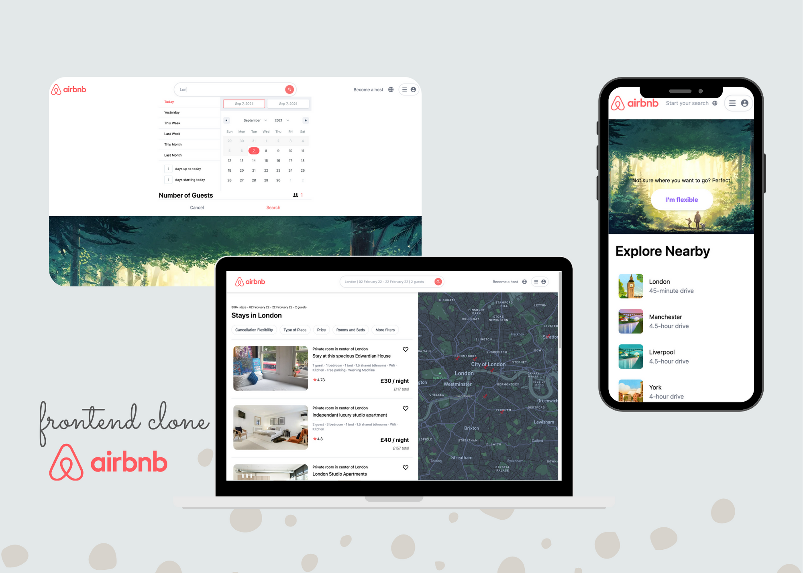

# Airbnb Frontend Clone

Airbnb clone built with Next.js, React, Tailwind CSS, MapBox, and deployed to Vercel. Web and mobile responsiveness. The application allows a user to select city, date range, and number of guests. The data displayed in the results is calling an API with static information. This app is designed to look like the Airbnb website but has limited functionality.

Screenshot of application:  

Link to live application: https://airbnb-wheat.vercel.app/

## Table of Contents

* [Installation](#Installation)
* [Usage](#Usage)
* [Contributing](#Contributing)
* [Tests](#Tests)
* [License](#License)
* [Questions](#Questions)

## Installation
Feel free to clone the repo or reference the code and remember to install all required packages

## Usage
The purpose of this build is for practicing the various technologies utilized. It is not fully functional nor does it accept payments.

## Contributing
We love seeing community contributions to opensource projects! Did I miss something? Want to make a suggestion? Find a spelling mistake? All messages are greatly appreciated! If you would like to contribute, please do.

## Tests
n/a

## License
This project is released under MIT opensource license:

https://opensource.org/licenses/MIT

## Questions
For more about my work, check out my Github profile: https://github.com/nard1n

If you have any questions and would like to chat, please feel free to send me an email directly to nardin.lachowski@gmail.com